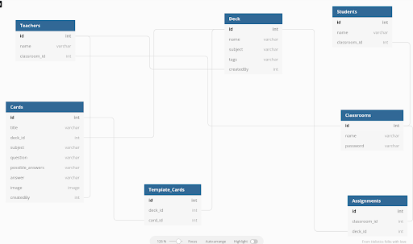

# OpenBook
*By Brandon Perry, Jacob Grooms, Philip Ling, Robin Scavo*

**Check out the live version [here](https://openbook-app.herokuapp.com/)**

**Table of Contents**
- [OpenBook](#openbook)
  - [OpenBook at a Glance](#openbook-at-a-glance)
  - [Application Architecture and Technologies Used](#application-architecture-and-technologies-used)
  - [Frontend Overview](#frontend-overview)
    - [React](#react)
    - [Redux](#redux)
  - [Backend Overview](#backend-overview)
    - [Authentication and Application Security](#authentication-and-application-security)
    - [Relational Database Design](#relational-database-design)
  - [Conclusion & Next Steps](#conclusion--next-steps)

## OpenBook at a Glance

OpenBook is a virtual learning platform modeled off of Quizlet and Nearpod. As a teacher, you can log in and create classrooms with multiple students, assigning them decks of flashcards that you can create or obtain from our library. These flashcards will give immediate feedback to students upon completion. As a student, you can join a classroom and see all the assignments that you have been given and complete them before the deadline.

## Application Architecture and Technologies Used

OpenBook was built with a backend server using the Flask framework. We used a PostgreSQL database to store all the data and the Flask-SQLAlchemy extension to incorporate SQLAlchemy ORM into our project

Our frontend was rendered using React, with a Redux store that maintains the whole state throughout our project. Components were styled with CSS.

## Frontend Overview

### React

The frontend was built out using React components and styled with CSS. An example is given below:

```js
const FullPageDiv = () => {
	const currentUser = useSelector((state) => state.session.user);
	if (!currentUser) {
		return <Redirect to="/" />;
	}
	return (
		<div className="fullPageDiv">
			<Banner />
			<div className="bodyDiv">
				<SideBar
					addToLibrary={false}
					addCardToDeck={false}
					createClass={true}
				/>
				<div className="mainDiv">
					{currentUser.teacher ? <TeacherHomePage /> : <StudentHomePage />}
				</div>
			</div>
		</div>
	);
};
```

### Redux

Redux posed a challenge this time around, but once it was set up properly, it was easy to access our information across components. We can also show updates in real time by using the useDispatch React Hook.

```js
// Here is a snippet that showcases the functions that allow us to edit our decks in real time

export const addCard = (cardId, deckId) => async (dispatch) => {
	const response = await fetch(`/api/cards/${cardId}/add_to_deck/${deckId}`, {method: 'POST'})
	const resJSON = await response.json();
	dispatch(setDeck(resJSON));
	return response;
};

export const removeCard = (cardId, deckId) => async (dispatch) => {
	const response = await fetch(`/api/cards/${cardId}/remove_from_deck/${deckId}`, {method: 'POST'})
	const resJSON = await response.json();
	dispatch(setDeck(resJSON));
	return response;
};
```

## Backend Overview

We accomplished a search and filter route, in just 4 lines of code. List comprehensions played a big role in our back end.

```py
@deck_routes.route('/search/<term>', methods=['GET'])
def deck_search(term):
    decks = db.session.query(Deck).all()

    return {"decks": [deck.to_dict() for deck in decks if term in deck.tags]}

```

### Authentication and Application Security

To authenticate a user, we implemented WTForms and used Flask-WTForms to incorporate it into our project. The validations used came from WTForms. Users' passwords were incremented using the Werkzeug library.

### Relational Database Design

This is our database schema:




## Conclusion & Next Steps

This was our first project using Python after learning it as our second language. We also had to learn an entire new package to write our server, Flask and utilize a new ORM, SQLAlchemy. The project presented us with a lot of challenges but it sharpened our problem-solving and communication skills. While the project is deployed, various additional features are in the works:

* Separate login for student
* Grading system
